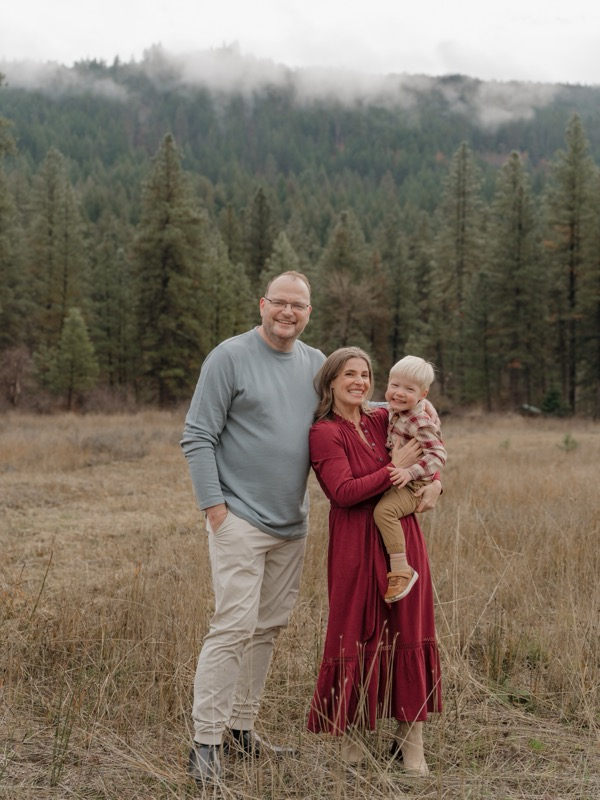

# Holly Hetherington — Portfolio Site

A clean, minimal portfolio site built with HTML and CSS. No frameworks, no dependencies, no build step.

## Structure

```
holly-portfolio/
├── index.html              ← Homepage
├── css/
│   └── style.css           ← All styles
└── case-studies/
    ├── ai-intake.html          ← Spring Health AI intake
    ├── suicide-prevention.html ← Facebook suicide prevention
    └── chatbot-voice.html      ← Spring Health chatbot voice
```

## Before you publish

1. **Add your photo:** Drop your headshot into an `images/` folder as `holly.jpg`. Then in `index.html`, replace the placeholder comment with:
   ```html
   
   ```

2. **Add your LinkedIn URL:** In `index.html`, find `YOUR-LINKEDIN` and replace it with your LinkedIn handle.

3. **Add your email:** In `index.html`, find `YOUR-EMAIL` and replace with your email address.

4. **Review the Facebook case study year:** Currently listed as 2016 — update if needed.

## Deploying to GitHub Pages

1. Create a new repo named exactly: `hollyhethie-oss.github.io`
2. Clone it locally:
   ```
   git clone https://github.com/hollyhethie-oss/hollyhethie-oss.github.io
   ```
3. Copy all files from this folder into the cloned repo
4. Push:
   ```
   git add .
   git commit -m "Initial portfolio launch"
   git push
   ```
5. Go to your repo Settings → Pages → set source to `main` branch
6. Your site will be live at: **https://hollyhethie-oss.github.io**

## Making updates later

Just edit the HTML files and push again:
```
git add .
git commit -m "Update [what you changed]"
git push
```
